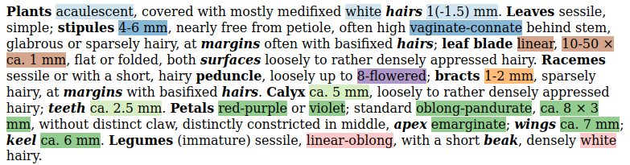
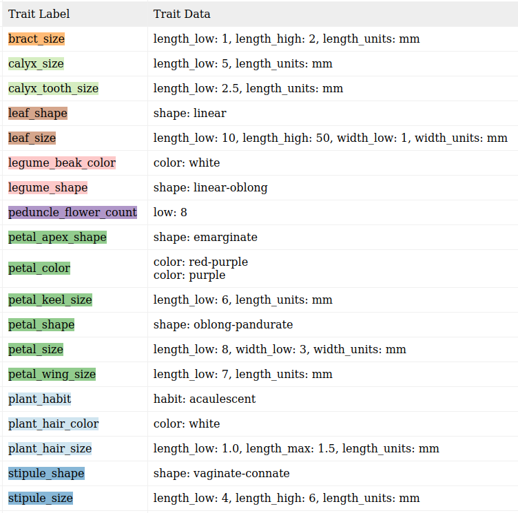

# The eFloras Traits Database Project [](https://travis-ci.org/rafelafrance/traiter_efloras)

## All right, what's this all about then?
**Challenge**: Extract trait information from plant treatments. That is, if I'm given treatment text like: (Reformatted to emphasize targeted traits.)



I should be able to extract: (Colors correspond to the text above.)



## Multiple methods for parsing
1. Rule based parsing. Most machine learning models require a substantial training dataset. I use this method to bootstrap the training data. And, if other methods fail, I can fall back to this.
1. Machine learning models. (In progress)

## Rule-based parsing strategy
1. I label terms using Spacy's phrase and rule-based matchers.
1. Then I match terms using rule-based matchers repeatedly until I have built up a recognizable trait like: color, size, count, etc.
1. Finally, I associate traits with plant parts.

For example, given the text: `Petiole 1-2 cm.`:
- I recognize vocabulary terms like:
    - `Petiole` is plant part
    - `1` a number
    - `-` a dash
    - `2` a number
    - `cm` is a unit notation
- Then I group tokens. For instance:
    - `1-2` is a range
- Next I recognize a size trait:
    - `1-2 cm` is a size notation which is made up of a range with units.
- Finally, I associate the size with the plant part `Petiole` by scanning sentences for even larger pattern matches and a few simple heuristics.
    - One heuristic is that treatments typically (but not always) put the plant part being discussed at the beginning of a sentence.

There are, of course, complications and subtleties not outlined above but you should get the gist of what is going on here.

## Install
You will need to have Python 3.8 (or later) installed. You can install the requirements into your python environment like so:
```
git clone https://github.com/rafelafrance/traiter_efloras.git
cd traiter_efloras
optional: virtualenv -p python3.8 venv
optional: source venv/bin/activate
python3 -m pip install --requirement requirements.txt
python3 -m pip install git+https://github.com/rafelafrance/traiter.git@master#egg=traiter
```

## Run
```
./extract.py ... TODO ...
```

## Tests
Having a test suite is absolutely critical. The strategy I use is every new trait gets its own test set. Any time there is a parser error I add the parts that caused the error to the test suite and correct the parser. I.e. I use the standard red/green testing methodology.

You can run the tests like so:
```
cd /my/path/to/eforas_traiter
python -m unittest discover
```
